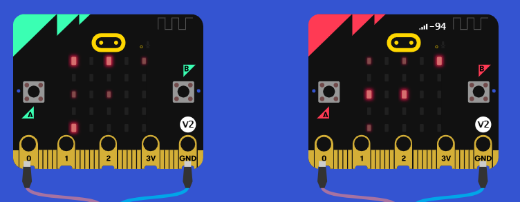
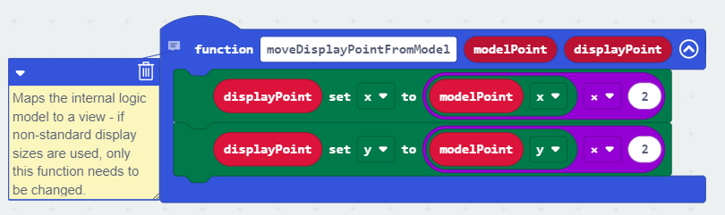
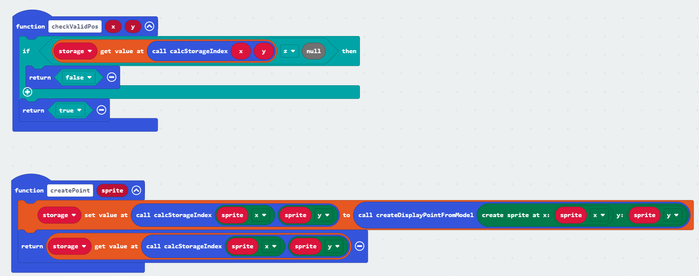

# Game Idea

We have implemented remote Tic-Tac-Toe.

The game follows the classic tic-tac-toe rules. Both Micro:bots load the
program, one initiates the game by making their first turn.\
The other Micro:bit receives the opponents turn via radio and can then
make their turn.

The Game continues until a player has marked three squares in a row,
column or diagonal in their \"color\".

# Controls

The active player has a blinking cursor marking the current position. By
pressing the $A$ button, it can be moved to the next position. Once the
desired position is reached, it can be selected by pressing the $B$
button. In this case, a bright player mark is placed and the turn is
over.

Controls are deactivated while it's the opponent's turn. Once the
opponent places a player mark, it is shown as a dim mark.

# Features

## Turn and Win Checking

The program ensures that only valid moves can be played: It ensures that
turns alternate between players, and that a player mark cannot be placed
on an occupied space.

The program also checks for a win after each turn, announcing a loss,
win or draw and refusing further input until the program is restarted.

## Cool sounds

The Micro:bits make sounds to communicate current states to players. An
error sound is played in case an illegal operation is attempted, other
sounds are played for successful moves and game ends.

## Extensibility

While the code is built for a 5x5 standard Micro:bit field, it has been
abstracted heavily and uses a model-view pattern. By changing only a few
values in code, the game can also be played on an arbitrarily big field.

# Code Stucture

Code has been commented and contains various functions to ensure clear
code structure.

Unfortunately, due to limitations with Micro:bit, some very hacky
solutions had to be used (e.g. in regards to storage management). We
were determined to implement the program without any extensions and have
managed to do so.

# Running the game

## From Release
Download the .hex file from release on two Micro:bits.

## Use as Extension

This repository can be added as an **extension** in MakeCode.

* open [https://makecode.microbit.org/](https://makecode.microbit.org/)
* click on **New Project**
* click on **Extensions** under the gearwheel menu
* search for **https://github.com/byte-kraken/microbit_tictactoe** and import

## Edit this project

To edit this repository in MakeCode.

* open [https://makecode.microbit.org/](https://makecode.microbit.org/)
* click on **Import** then click on **Import URL**
* paste **https://github.com/byte-kraken/microbit_tictactoe** and click import

#### Metadata (used for search, rendering)

* for PXT/microbit

